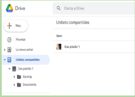
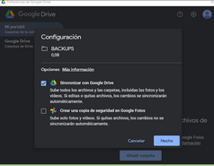
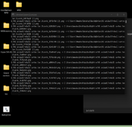
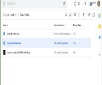
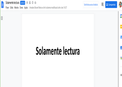

# Cas pràctic 1

Instal·larem la versió Google drive per escriptori, es una instal·lació simple i l’usuari no tindrà cap problema en realitzar-la.

## Procediment de creació

- El primer pas serà crear una unitat per a compartir.

- El segon pas es afegir els membres que voldràs que formin part de la unitat compartida.

- El tercer pas es crear les  subcarpetes que necessitem.

- El quart pas es afegir els permisos.

## Creació de unitat compartida

## Procediment de creació

En Google drive d’escriptori tenim que anar a preferències, cliquem allí i ja podrem seleccionar la carpeta de la qual vulguem fer la copia de seguretat.

## Procediment

En explorador d’arxius allí agafem i crearem un accés directe de les dues carpetes a l’escriptori

## Extra backup

Com ha seguretat extra hem decidit comprar un disc dur per utilitzar-lo coma copia de seguretat del backup de Drive, per fer la copia em utilitzat un script de Xcopy diferencial junt amb una tasca programada per que cada dia executi la copia automàticament.

## Perquè és una bona solució 

Considerem que tindre una copia de seguretat amb Google drive es una bona aposta, es un servei que es documental, es bastant transparent de cara a l’usuari, donat que es senzill d’utilitzar i te múltiples funcionalitats, el preu es ajustat al serveis que ens ofereix, però també penso que apart tindríem que afegir la copia de seguretat local, però si algun dia falla la línia o els serveis.

## Paradigma “Usuari”

